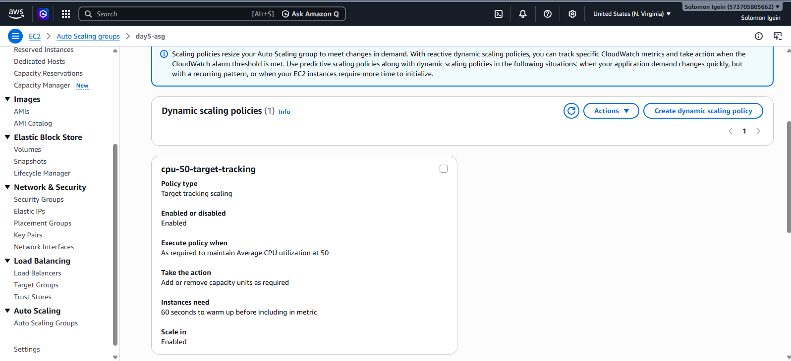

# Day 9: Auto Scaling Policies + Lifecycle Hooks - Full Tutorial
**AWS SAA-C03 60-Day Challenge | Solomon Igein | 03/08/2026 | Account 573705805662 us-east-1**

> The most tested ASG topic for SAA-C03: Target Tracking, Scheduled Scaling, Predictive Scaling, and Lifecycle Hooks

---

## 📸 Portfolio Proofs

| Screenshot | What It Proves |
|---|---|
| `9D1-target-tracking-created.png` | Target Tracking Policy `cpu-50-target-tracking` Enabled at 50% CPU |
| `9D2-scheduled-action-created.png` | Scheduled Action `day9-morning-scale-out` Desired 3 at 09:00 UTC |
| `9D3-lifecycle-launch-hook-created.png` | Launch Hook `day9-launch-hook` Created |
| `9D4-lifecycle-hooks-both-created.png` | **Both Hooks (2)** LAUNCHING + TERMINATING 300s CONTINUE |




---

## Part 1: Target Tracking Scaling Policy [MOST IMPORTANT]

**Concept:** ASG automatically maintains a metric at a target value. You define the target, AWS creates and manages CloudWatch alarms.

**Exam Question Pattern:**
> "Application needs to keep CPU at 50%, automatically add/remove EC2 instances as needed"

**Answer:** Target Tracking Policy

**Steps Executed:**
1. EC2 Console > Auto Scaling Groups > `day5-asg`
2. Tab: Automatic scaling
3. Dynamic scaling policies (0) > Create dynamic scaling policy
4. Configuration:
   - Policy type: **Target tracking scaling**
   - Policy name: `cpu-50-target-tracking`
   - Metric type: **Average CPU utilization**
   - Target value: `50`
   - Instance warmup: `60 seconds` (time to ignore new instance while warming)
   - Scale-in: **Enabled**
5. Create

**Result Verified:**
```
Dynamic scaling policies (1)
Name: cpu-50-target-tracking
Type: Target tracking scaling
Enabled: Yes
Execute when: As required to maintain Average CPU utilization at 50
Take the action: Add or remove capacity units as required
Instances need: 60 seconds to warm up
Scale in: Enabled
```

**How It Works:**
```
CPU 80% -> CloudWatch Alarm (AWS managed) -> ASG Launches 1 EC2 -> CPU drops to 50%
CPU 20% -> CloudWatch Alarm -> ASG Terminates 1 EC2 -> CPU rises to 50%
```

**SAA-C03 Gold:** Preferred over Simple/Step scaling. No need to manually create alarms.

---

## Part 2: Scheduled Scaling (Predictable Traffic)

**Concept:** Scale based on time. Proactive, not reactive.

**Exam Question Pattern:**
> "Traffic spikes every Monday 8AM to 5PM, low at night. How to handle predictably?"

**Answer:** Scheduled Scaling

**Steps Executed:**
1. Automatic scaling > Scheduled actions (0) > Create scheduled action
2. Name: `day9-morning-scale-out`
3. Desired capacity: `3` (Min/Max optional)
4. Recurrence: **Once**
5. Start date: `2026/08/03`
6. Start time: `09:00` Etc/UTC
7. Time zone: Etc/UTC
8. Create -> Green banner: `Scheduled action created or edited successfully`

**Result Verified:**
```
Scheduled actions (1)
Name: day9-morning-scale-out
Start time: 2026 August 03 09:00 UTC
Time zone: Etc/UTC
Desired: 3
```

**Optional 2nd Action (Scale-in):**
- Name: `day9-evening-scale-in`
- Desired: `1`
- Time: `18:00`

**Key Difference:**
- Target Tracking = Reactive (CPU high? Scale)
- Scheduled = Proactive (It's 9AM? Scale)

---

## Part 3: Lifecycle Hooks (Pro Level - Separates Beginners from Certified)

**Concept:** Pause EC2 launch/termination in a wait state to run custom actions.

**Why Needed:**
- **Launching Hook:** Install software, pull code from S3, warm cache, register with Chef BEFORE going InService
- **Terminating Hook:** Drain ALB connections, upload logs to S3, backup, deregister BEFORE termination

**Integration with Day 8:**
```
EC2 Launching -> Hook: LAUNCHING -> Wait 300s -> SNS (day7-alarms) / EventBridge (day8-asg-events) -> Lambda installs app -> complete-lifecycle-action CONTINUE -> InService

EC2 Terminating -> Hook: TERMINATING -> Wait 300s -> Drain connections -> CONTINUE -> Terminated
```

**Hook 1: Launch Hook**

1. Tab: Instance management > Lifecycle hooks (0) > Create lifecycle hook
2. Name: `day9-launch-hook`
3. Lifecycle transition: `Instance launch` = `autoscaling:EC2_INSTANCE_LAUNCHING`
4. Heartbeat timeout: `300` seconds (Range: 30-7200s, how long ASG waits)
5. Default result: `CONTINUE` (If timeout, proceed)
6. Notification target: Optional - SNS `day7-alarms` (from Day 7)
7. Create

**Hook 2: Terminate Hook**

1. Create lifecycle hook
2. Name: `day9-terminate-hook`
3. Transition: `Instance terminate` = `autoscaling:EC2_INSTANCE_TERMINATING`
4. Heartbeat: `300`
5. Default: `CONTINUE`
6. Create

**Result Verified:**
```
Lifecycle hooks (2)
day9-launch-hook | autoscaling:EC2_INSTANCE_LAUNCHING | CONTINUE | 300
day9-terminate-hook | autoscaling:EC2_INSTANCE_TERMINATING | CONTINUE | 300
Warm pool: No warm pool currently configured.
```

**SAA-C03 Key Concepts:**
- **Heartbeat timeout:** Time ASG waits in Pending:Wait or Terminating:Wait
- **CONTINUE:** Proceed with launch/termination after hook completes or timeout
- **ABANDON:** For LAUNCHING, ABANDON terminates instance if hook fails
- **Notification:** Can send to SNS, SQS, EventBridge to trigger Lambda
- **Manual completion:** `aws autoscaling complete-lifecycle-action --lifecycle-action-result CONTINUE`
- **Exam Trap:** If hook + warm pool, hook executes on warm pool instance first

---

## Part 4: Verification & Cleanup

**Activity Tab:**
- ASG > Activity tab shows history: `Launching a new EC2 instance: i-xxxx`, `Terminating EC2 instance`

**Check All Policies:**
- Automatic scaling tab: 1 Target Tracking + 1 Scheduled + 0 Predictive
- Instance management: Lifecycle hooks (2)

**Cost Note:** Lifecycle hooks don't add cost, but waiting instances in wait state still run and cost. Keep heartbeat reasonable (300s).

---

## Architecture Diagram - Day 9 Final

```
Internet -> ALB (day5-alb) -> Target Group -> ASG day5-asg (Min 1, Max 3, Desired 1)

ASG Policies:
├── Target Tracking: cpu-50-target-tracking (Enabled, CPU 50%, Warmup 60s, Scale-in Enabled)
├── Scheduled: day9-morning-scale-out (Once 2026-08-03 09:00 UTC Desired 3)
└── Lifecycle Hooks (2):
    ├── day9-launch-hook: LAUNCHING 300s CONTINUE [Custom Init]
    └── day9-terminate-hook: TERMINATING 300s CONTINUE [Graceful Drain]

Day 7-8 Integration:
├── SNS Topic: day7-alarms -> Email + Lambda Fanout
└── EventBridge Rule: day8-asg-events -> Lambda Auto-Remediation

Launch Template: day5-lt-golden v1 (Golden AMI from Day 5)
Region: us-east-1 | Account: Solomon Igein (573705805662)
```

---

## 💡 SAA-C03 Exam Cheat Sheet - Day 9

| Policy Type | When to Use | Who Creates Alarm? | SAA Priority |
|---|---|---|---|
| **Target Tracking** | Keep metric at target (CPU 50%, ALB RequestCountPerTarget, NetworkIn) | AWS automatically | **HIGH - Most common** |
| **Scheduled** | Known schedule (Business hours 9-5, Weekend off, Monday 8AM spike) | None - time-based | **HIGH** |
| **Predictive** | AI forecast from history, recurring daily/weekly patterns | AWS | **MEDIUM** |
| **Simple/Step** | Legacy, you create CloudWatch alarm + manual step adjustments | You | **LOW - Know but prefer Target** |

**Lifecycle Hooks Must-Know:**
- Two transitions: `EC2_INSTANCE_LAUNCHING` and `EC2_INSTANCE_TERMINATING`
- States: `Pending:Wait` and `Terminating:Wait`
- Timeout 30-7200s, default CONTINUE
- Use case LAUNCHING: Install Chef, pull from S3, init scripts
- Use case TERMINATING: Upload logs, deregister from Consul, connection draining

---

## Next: Day 10 Preview

- Warm Pools: Pre-initialize instances to reduce scale-out latency (90% faster!)
- Instance Refresh: Rolling update when Launch Template changes
- Cost Optimization & Final Cleanup for Week 2
- Portfolio polish

---

**Repo:** `solomonigein-collab/aws-saa-c03-journey` | **Day:** 9/60 | **Status:** Complete ✅ | **Date:** 03/08/2026
